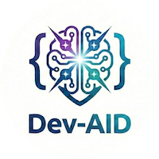

# 🚀 Dev-AID (Development AI Driver)

**Expert Skills, Multi-AI Routing, Local Semantic Search, and Persistent Context for AI-Assisted Development**

> Configuration framework that enhances Claude Code, Gemini CLI, and other AI tools with 65 expert skills, multi-AI routing, 100% local RAG, automated security scanning, and persistent memory.

---

## 🎯 What is Dev-AID?

**Dev-AID is NOT a standalone CLI tool.** It's a configuration and automation layer that enhances your existing AI development tools with powerful capabilities.

### How It Works

```
┌─────────────────────────────────────────────┐
│  You Use (pick one):                        │
│  • claude code                              │
│  • cursor .                                 │
│  • gemini-cli                               │
│  • Any AI tool that reads config files      │
└─────────────────┬───────────────────────────┘
                  │ reads configuration
                  ↓
┌─────────────────────────────────────────────┐
│  Dev-AID (Configuration Layer)              │
│  • Local semantic search (100% private)     │
│  • Multi-AI routing (Claude ⇄ Gemini)       │
│  • 65 expert skills (auto-activated)        │
│  • Persistent memory bank                   │
│  • Automated security scans                 │
│  • Specialized slash commands               │
└─────────────────────────────────────────────┘

Examples:
• "Find authentication functions" → Local RAG finds them ($0, private)
• /aid-router-challenger "Implement OAuth2" → Claude codes, Gemini reviews
• Edit auth.ts → Auto-loads devsecops-expert skill
• git commit → Runs security scans (Opengrep, Gitleaks, Trivy)
• /aid-router-status → View routing stats and costs
```

---

## ✨ Key Features

### 🔍 **Local Semantic Code Search** (NEW!)
- **100% local** - Code never leaves your machine
- **$0 forever** - No API costs for embeddings
- **claude-context-local** - Google's EmbeddingGemma model
- **Fast** - 0.15s queries with FAISS
- **Smart** - AST parsing for 9+ languages
- **MCP native** - Works with Claude Code & Gemini CLI

### 🔀 **Multi-AI Router** (NEW!)
- **Challenger mode** - Claude generates, Gemini reviews
- **Ensemble mode** - Route to best AI for each task
- **Cost optimization** - Gemini for large context (97% cheaper)
- **Configuration-driven** - JSON-based routing rules
- **Slash commands** - `/aid-router-challenger`, `/aid-router-ensemble`

### 🎓 **65 Expert Skills**
- Auto-activate based on context (e.g., `*auth*` → devsecops-expert)
- Manual activation via skill name
- Custom skill generation with `/aid-build-skill`
- Domains: DevSecOps, TDD, API design, databases, etc.

### 💾 **Persistent Memory Bank**
- Context survives across sessions
- Architecture decisions (ADRs)
- Code patterns & anti-patterns
- Security guidelines

### 🔒 **Automated Security**
- Pre-commit hooks: Secrets scan, SAST, Critical CVEs (~10s)
- Pre-push hooks: Full SAST, git history scan (~60s)
- 5 Security tools: Opengrep, Gitleaks, Trivy, Hadolint, Checkov

### ⚙️ **Provider Agnostic**
- Works with Claude Code, Cursor, Gemini CLI
- Multi-provider routing support
- Consistent experience across tools

---

## 🚀 Quick Start

### Option 1: New Project with Dev-AID

```bash
# Clone Dev-AID standalone
git clone <repo> my-project
cd my-project

# Copy Dev-AID configuration
cp -r dev-aid-standalone/.dev-aid .

# Initialize (with optional RAG)
./.dev-aid/scripts/init-repo.sh
# Answer "Y" to install claude-context-local

# Done! Start using
claude code
# or
gemini-cli
```

### Option 2: Add to Existing Project

```bash
# Copy Dev-AID to your project
cd ~/my-existing-project
cp -r /path/to/dev-aid-standalone/.dev-aid .

# Initialize
./.dev-aid/scripts/init-repo.sh

# Done!
```

### Option 3: Just Add RAG to Existing Dev-AID

```bash
# If you already have Dev-AID
cd your-project

# Add local semantic search
./.dev-aid/scripts/setup-rag.sh

# 5 minutes later: RAG ready!
```

---

## 📚 Available Slash Commands

### 🔍 **RAG Commands** (Local Semantic Search)

**In Claude Code or Gemini CLI:**

```bash
# Find code with natural language
You: "Find all authentication functions"
AI: *uses local RAG, returns relevant code*

# Or via router with RAG
/aid-router-challenger-rag "Implement password reset"
```

**What happens:**
1. Searches codebase semantically (local, $0 cost)
2. Finds similar implementations & patterns
3. Claude generates using YOUR codebase style
4. Gemini reviews for security issues

### 🔀 **Router Commands** (Multi-AI Orchestration)

#### `/aid-router-challenger`
**Two-AI review workflow**

```bash
/aid-router-challenger "Implement OAuth2 authentication"
```

**Process:**
1. Claude generates implementation
2. Gemini reviews for security issues
3. Claude refines based on feedback
4. You see both perspectives

**Best for:** Security-critical features, auth, payments, encryption

---

#### `/aid-router-challenger-rag`
**Challenger mode + Local RAG**

```bash
/aid-router-challenger-rag "Add password validation"
```

**Process:**
1. **Local search** finds existing patterns (0.15s, $0)
2. Claude generates using your patterns
3. Gemini reviews with same context
4. Result: Code matching your style + security review

**Best for:** When you have similar code and want consistency

---

#### `/aid-router-ensemble`
**Smart routing to optimal AI**

```bash
/aid-router-ensemble "Analyze entire codebase for security issues"
```

**Routing logic:**
- **Massive context** (100k+ tokens) → Gemini Flash (2M context, 97% cheaper)
- **Code generation** → Claude Sonnet (best coder)
- **Security audit** → Claude Sonnet (security expert)
- **Documentation** → GPT-4o (clear writing)
- **Complex reasoning** → Claude Opus (maximum capability)

**Best for:** Cost optimization, automatic best-AI selection

---

#### `/aid-router-status`
**View routing stats**

```bash
/aid-router-status
```

**Shows:**
- Current routing configuration
- Cost breakdown by model
- Recent routing decisions
- Budget status (under/over limit)

---

### 🛠️ **Development Commands**

#### `/aid-audit`
Security audit with 5 tools

```bash
/aid-audit
```

Runs: Opengrep, Gitleaks, Trivy, Hadolint, Checkov

---

#### `/aid-build-skill`
Generate custom expert skill

```bash
/aid-build-skill "Create a Kubernetes expert skill"
```

Generates skill with references, activation rules, and context.

---

#### `/aid-deploy-validate`
Pre-deployment validation

```bash
/aid-deploy-validate production
```

Validates: Dependencies, configs, security, tests

---

#### `/aid-test-suite`
Run comprehensive test suite

```bash
/aid-test-suite
```

Runs all tests with coverage

---

## 🔧 Configuration

### Router Configuration

**File:** `.dev-aid/config/routing.json`

```json
{
  "default_mode": "solo",
  "modes": {
    "challenger": {
      "enabled": true,
      "primary_model": "claude-sonnet",
      "challenger_model": "gemini-flash",
      "auto_refine_on": ["HIGH", "CRITICAL"],
      "review_triggers": [
        "auth", "password", "crypto", "payment"
      ]
    },
    "ensemble": {
      "enabled": true,
      "routing_strategy": "semantic",
      "task_routes": {
        "massive_context": "gemini-flash",
        "code_generation": "claude-sonnet",
        "security_audit": "claude-sonnet"
      }
    }
  },
  "cost_limit_per_day": 100.0
}
```

### Model Registry

**File:** `.dev-aid/config/models.json`

```json
{
  "models": {
    "claude-sonnet": {
      "provider": "anthropic",
      "cost_per_mtok": {"input": 3.0, "output": 15.0},
      "strengths": ["code_generation", "security"]
    },
    "gemini-flash": {
      "provider": "google",
      "cost_per_mtok": {"input": 0.075, "output": 0.30},
      "max_context": 2000000,
      "strengths": ["massive_context", "cost_effective"]
    }
  }
}
```

---

## 🔍 RAG (Local Semantic Search)

### What is RAG?

**Retrieval-Augmented Generation** - AI finds relevant code in your codebase before answering.

**Traditional:** AI only knows what you tell it
**With RAG:** AI searches your codebase, finds examples, then answers

### Why Local RAG?

**Cloud RAG:**
- ❌ Costs $0.13/M tokens (OpenAI embeddings)
- ❌ Code sent to API (privacy concern)
- ❌ Requires internet

**Local RAG (claude-context-local):**
- ✅ $0 forever
- ✅ 100% private (code never leaves machine)
- ✅ Works offline
- ✅ Fast (0.15s queries)

### Setup RAG

```bash
# One command setup (5 minutes)
./.dev-aid/scripts/setup-rag.sh
```

**What it does:**
1. Installs claude-context-local
2. Downloads EmbeddingGemma model (1.2GB)
3. Registers MCP with Claude Code or Gemini CLI
4. Indexes your codebase
5. Creates helper scripts

### Using RAG

**Automatic (in Claude Code):**
```
You: "Find all password validation functions"
Claude: *automatically uses local RAG*
# Returns: src/auth/password.py:12, src/utils/validation.py:45
```

**Via Router:**
```bash
/aid-router-challenger-rag "Implement authentication"
# Uses RAG to find existing patterns, then generates
```

### RAG Maintenance

```bash
# Check status
./.dev-aid/scripts/rag-status.sh

# Reindex after changes
./.dev-aid/scripts/reindex-codebase.sh

# Auto-reindex on commits (optional)
# Git hook created during setup
```

### Supported Languages (RAG)

**AST-parsed (best results):**
- Python, JavaScript, TypeScript, Java, Go, Rust, C/C++, C#, Svelte

**Text-indexed (good results):**
- Markdown, JSON, TOML, YAML, XML

---

## 🏗️ Architecture

### Directory Structure

```
.dev-aid/
├── 📄 RAG-SETUP.md                    # RAG documentation
│
├── 📁 config/
│   ├── routing.json                   # Router configuration
│   ├── models.json                    # Model registry
│   ├── mcp-template.json              # MCP configuration
│   ├── orchestration.json             # Orchestration rules
│   └── settings.json                  # Global settings
│
├── 📁 providers/
│   ├── 📄 CLAUDE-CONTEXT-LOCAL.md     # Local RAG analysis
│   ├── 📄 CROSS-PLATFORM-ROUTER.md    # Router guide
│   ├── 📄 RAG-IMPLEMENTATION.md       # RAG overview
│   │
│   ├── claude/
│   │   └── .claude/
│   │       ├── commands/router/
│   │       │   ├── aid-router-challenger.md
│   │       │   ├── aid-router-challenger-rag.md
│   │       │   ├── aid-router-ensemble.md
│   │       │   └── aid-router-status.md
│   │       └── skills/expert/ (65 skills)
│   │
│   └── gemini/
│       └── .gemini/
│           └── commands/router/
│               ├── aid-router-challenger.toml
│               ├── aid-router-challenger-rag.toml
│               ├── aid-router-ensemble.toml
│               └── aid-router-status.toml
│
├── 📁 memory-bank/
│   ├── activeContext.md               # Current sprint
│   ├── patterns.md                    # Code patterns
│   ├── decisions.md                   # ADRs
│   └── security.md                    # Security context
│
├── 📁 scripts/
│   ├── init-repo.sh                   # Initialize Dev-AID
│   ├── setup-rag.sh                   # Setup local RAG
│   ├── reindex-codebase.sh            # Reindex for RAG
│   └── rag-status.sh                  # Check RAG status
│
└── 📁 automation/
    ├── pre-commit                     # Security hooks
    └── pre-push                       # Full audit
```

---

## 💰 Cost Analysis

### Without Dev-AID Router

```
# All requests go to Claude Sonnet
100 requests/month × 150k tokens × $3/M = $45/month
```

### With Dev-AID Router (Ensemble Mode)

```
# Smart routing
30 code requests → Claude Sonnet     = $13.50
50 large context → Gemini Flash      = $0.75
20 docs → GPT-4o                     = $7.50

Total: $21.75/month
Savings: $23.25/month (52% reduction)
```

### With RAG (Local Semantic Search)

```
# Traditional approach
100 requests × 150k tokens = 15M tokens
Embeddings (OpenAI): $1.95

# With claude-context-local
100 requests × 50k tokens = 5M tokens (67% reduction)
Embeddings: $0 (local)

Additional savings: $11.70/month
Total savings: $35/month (78% reduction)
```

---

## 🎓 Expert Skills (65 Skills)

### Core Skills
- **devsecops-expert** - Security-first development
- **tdd-expert** - Test-driven development
- **code-reviewer** - Code quality analysis
- **secret-scanner** - Credential detection

### Domain Experts (Sample)
- **api-expert** - REST API design
- **database-design** - Schema optimization
- **async-expert** - Async/await patterns
- **graphql-expert** - GraphQL best practices
- **fastapi-expert** - FastAPI patterns
- **rust** - Rust programming
- **typescript-expert** - TypeScript patterns
- **cicd-expert** - CI/CD pipelines
- **appsec-expert** - Application security
- **llm-integration** - LLM integration patterns

[See full list in `.dev-aid/providers/claude/.claude/skills/expert/`]

### Auto-Activation Rules

Skills auto-activate based on file patterns:

```json
{
  "devsecops-expert": ["*auth*", "*password*", "*token*", "*session*"],
  "database-design": ["*schema*", "*migration*", "*model*"],
  "api-expert": ["*api*", "*endpoint*", "*route*"]
}
```

**Example:**
```bash
# Edit src/auth/password.py
# → devsecops-expert auto-loads
# → security.md context added
# → OWASP guidelines active
```

---

## 🔒 Security Automation

### Git Hooks

**Pre-commit (~10s):**
- ✅ Secrets scan (Gitleaks)
- ✅ SAST - ERROR only (Opengrep)
- ✅ Critical CVEs (Trivy)

**Pre-push (~60s):**
- ✅ Full SAST (Opengrep)
- ✅ Git history scan (Gitleaks)
- ✅ Dependency audit (Trivy)
- ✅ Container scan (Trivy + Hadolint)
- ✅ IaC scan (Checkov)

### Security Tools

1. **Opengrep** - SAST (OWASP Top 10)
2. **Gitleaks** - Secrets detection
3. **Trivy** - Vulnerability scanning
4. **Hadolint** - Dockerfile linting
5. **Checkov** - IaC security

---

## 🆚 Comparison

### vs Manual Configuration

| Feature | Manual | Dev-AID |
|---------|--------|---------|
| Expert skills | Write yourself | 65 pre-built |
| Security scans | Remember to run | Automated (git hooks) |
| Memory bank | Manual notes | Persistent, auto-loaded |
| Multi-AI routing | Manual switching | Automatic routing |
| Local RAG | Complex setup | One command |
| Slash commands | Create each one | All included |
| Time to setup | Days | 5 minutes |

### vs Cloud RAG

| Feature | Cloud RAG | Dev-AID Local RAG |
|---------|-----------|-------------------|
| Cost | $0.13/M tokens | $0 forever |
| Privacy | Code sent to API | 100% local |
| Speed | 0.3-0.5s + network | 0.15s (local) |
| Offline | ❌ No | ✅ Yes |
| Setup | API keys, config | One command |

---

## 📖 Documentation

### Quick References
- **RAG-SETUP.md** - Complete RAG setup guide
- **CLAUDE-CONTEXT-LOCAL.md** - Local RAG analysis
- **CROSS-PLATFORM-ROUTER.md** - Router implementation guide
- **RAG-IMPLEMENTATION.md** - RAG options overview
- **LIGHTRAG-AND-FORMATS.md** - Format support comparison
- **LLAMAINDEX-ANALYSIS.md** - LlamaIndex analysis

### Provider Docs
- **providers/claude/CLAUDE.md** - Claude Code setup
- **providers/gemini/GEMINI.md** - Gemini CLI setup
- **providers/openai/OPENAI.md** - OpenAI integration

---

## 🤝 Contributing

### Adding New Skills

```bash
# Use built-in generator
/aid-build-skill "Create a [domain] expert skill"

# Or manually:
# 1. Create .dev-aid/providers/claude/.claude/skills/expert/your-skill/
# 2. Add skill.json with metadata
# 3. Add references/*.md with documentation
```

### Adding Router Commands

**Claude Code:** Add `.md` file to `.claude/commands/router/`
**Gemini CLI:** Add `.toml` file to `.gemini/commands/router/`

See existing commands as templates.

---

## 🐛 Troubleshooting

### RAG Issues

**"MCP tool 'code-search' not found"**
```bash
./.dev-aid/scripts/setup-rag.sh
```

**"No results found" or poor quality**
```bash
./.dev-aid/scripts/reindex-codebase.sh
```

**Check RAG status**
```bash
./.dev-aid/scripts/rag-status.sh
```

### Router Issues

**"Command not found"**
- Ensure you're in project root with `.dev-aid/` directory
- For Claude Code: Commands are in `.claude/commands/router/`
- For Gemini CLI: Commands are in `.gemini/commands/router/`

**Costs too high**
```bash
# Check routing config
cat .dev-aid/config/routing.json

# View current costs
/aid-router-status

# Adjust cost_limit_per_day
```

---

## 📝 License

[Your license here]

---

## 🙏 Acknowledgments

- **claude-context-local** by FarhanAliRaza - Local semantic code search
- **Claude Code** by Anthropic - Primary AI development tool
- **Gemini CLI** by Google - Multi-model AI access
- **Security tools** - Opengrep, Gitleaks, Trivy, Hadolint, Checkov

---

## 🔗 Links

- **Documentation:** `.dev-aid/` directory
- **Issues:** [GitHub Issues]
- **Discussions:** [GitHub Discussions]

---

**Dev-AID: Because your AI assistant should be as smart as your best senior developer.**
